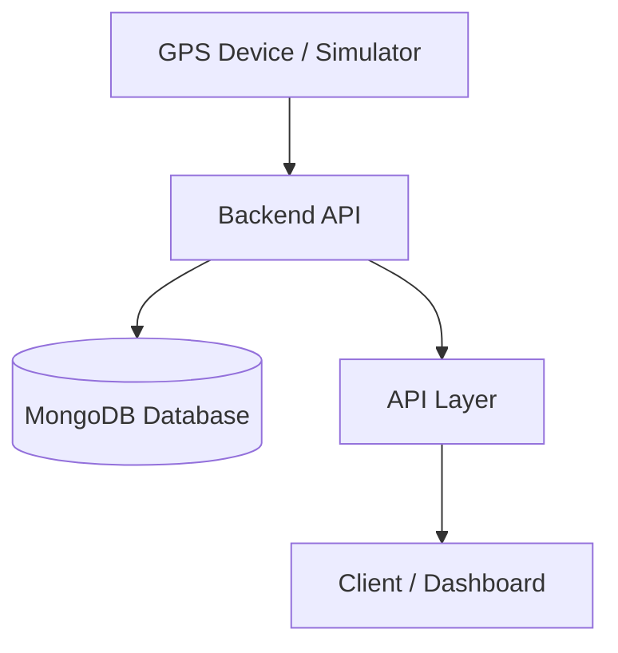

<div align="center">

# 📍 GPS Trail Tracker

**A Real-Time Location Tracking & Simulation System**

[]()
[]()
[]()
[]()

A lightweight backend system that captures, stores, and serves GPS location data with support for simulated real-time tracking.

</div>

---

## 📌 Executive Summary

GPS Trail Tracker is designed to simulate and manage real-world location tracking systems.

It provides a backend pipeline that:
- Accepts GPS coordinates from devices or simulators
- Stores them efficiently in a database
- Exposes APIs for retrieval and analysis

This ensures:
- Reliable location data storage
- Simple integration with frontend or mobile apps
- Scalable backend design for tracking systems

---

## 🧠 Core Capabilities

- 📍 Real-time GPS data ingestion
- 🗂️ Historical location tracking
- 🔌 REST API for data access
- 🧪 Built-in GPS simulator for testing
- ⚡ Lightweight backend architecture
- 📊 Time-based location queries

---

## 🏗 System Architecture



---

## ⚙️ Tech Stack

### Backend
- Node.js
- Express.js

### Database
- MongoDB (Mongoose)

### Simulation
- Custom Node.js script (Axios-based)

### Tools
- Postman (API testing)

---

## 📁 Project Structure

```
gps_tracker/
├── backend/
│   ├── server.js
│   ├── db.js
│   ├── models/
│   ├── routes/
│
├── simulator/
│   ├── simulator.js
│
├── .env
├── .gitignore
└── README.md
```

---

## 🔄 System Workflow

### Step 1 — Data Generation
- GPS coordinates are generated via simulator or device

### Step 2 — Data Ingestion
- Data is sent to backend via API

### Step 3 — Storage
- Stored in MongoDB with timestamp

### Step 4 — Retrieval
- APIs return:
  - Latest location
  - Full location history

---

## 🚀 Quickstart

### 1. Clone Repository

```bash
git clone <repo-url>
cd gps_tracker
```

---

### 2. Setup Backend

```bash
cd backend
npm install
npm start
```

---

### 3. Setup Environment

Create `.env` file:

```
PORT=5000
MONGO_URI=mongodb://127.0.0.1:27017/gps_tracker
```

---

### 4. Run Simulator

```bash
cd simulator
npm install
npm start
```

---

## 🔌 API Endpoints

### 📍 Add Location

```http
POST /api/location
```

```json
{
  "latitude": 17.3850,
  "longitude": 78.4867
}
```

---

### 📍 Get All Locations

```http
GET /api/locations
```

---

### 📍 Get Latest Location

```http
GET /api/location/latest
```

---

## 🧪 Example Workflow

1. Start backend server  
2. Run simulator  
3. GPS data sent every few seconds  
4. Retrieve data via API  
5. Visualize or analyze movement  

---

## 📊 Use Cases

- Fleet tracking systems  
- Delivery tracking  
- Fitness tracking apps  
- Location analytics  

---

## 🧩 Design Principles

- Simple and modular backend
- Real-time data simulation
- Scalable API structure
- Clean separation of concerns

---

## 🚨 Limitations

- No authentication system
- No frontend visualization
- Basic error handling

---

## 🔮 Future Enhancements

- 🗺️ Map-based UI (Google Maps / Leaflet)
- 🔐 User authentication
- 📡 WebSocket real-time updates
- 📊 Analytics dashboard
- 📱 Mobile integration

---

## 🎯 Final Note

This project is built as a **backend system prototype** for real-time tracking applications.

It demonstrates:
- API design
- Database integration
- Real-time data handling
- System-level thinking

---

## 📜 License

MIT License

---

## 🤝 Contributions

Pull requests are welcome. Open an issue for major changes.

---
