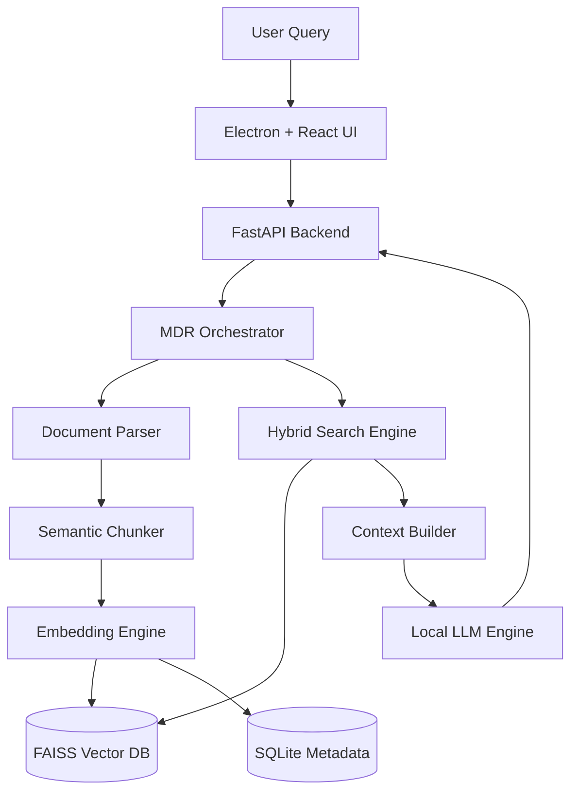

Got it — you want **ONE single copy-pasteable block**. No splits. No breaks. Clean, senior-level README.

Here it is:

````markdown
<div align="center">

# ⬛ Project Macrodata

**An Air-Gapped Macrodata Refinement (MDR) Pipeline & Knowledge System**

[]()
[]()
[]()
[]()

A privacy-first, fully offline AI system that ingests unstructured data, refines it into structured knowledge, and enables high-precision retrieval using Advanced RAG — all without any cloud dependency.

</div>

---

## 📌 Executive Summary

Project Macrodata is designed for **zero-trust environments** where data cannot leave local infrastructure.

It implements an **MDR (Macrodata Refinement) pipeline**:
- Converts raw documents → structured embeddings
- Stores them in a local vector space
- Uses a local LLM for grounded, verifiable responses

This ensures:
- No external API calls
- No data leakage
- Controlled, explainable AI outputs

---

## 🧠 Core Capabilities

- 📂 Offline document ingestion (PDF, TXT, JSON)
- 🧩 Semantic chunking with contextual boundaries
- 🔍 Hybrid retrieval (vector + keyword search)
- 🧠 Local LLM inference (no internet required)
- 📊 Source-grounded answers (hallucination control)
- 🖥 Desktop application (Electron-based UI)
- 🔐 Full data sovereignty

---

## 🏗 System Architecture



---

## ⚙️ Tech Stack

### Backend
- FastAPI
- Python
- Uvicorn

### AI / RAG
- LangChain / LlamaIndex
- SentenceTransformers
- FAISS (Vector DB)
- Local LLM (Ollama / GGUF models)

### Desktop App
- Electron.js
- React.js

### Storage
- SQLite (metadata)
- FAISS (embeddings)

### DevOps / Infra
- Docker
- GitHub Actions

---

## 📁 Project Structure

```
project-macrodata/
├── backend/
│   ├── main.py
│   ├── routes/
│   ├── services/
│   │   ├── ingestion.py
│   │   ├── chunking.py
│   │   ├── embedding.py
│   │   ├── retrieval.py
│   │   └── llm.py
│   ├── db/
│   │   ├── vector_store.py
│   │   └── metadata.db
│   └── config.py
│
├── frontend/
│   ├── src/
│   └── public/
│
├── electron/
│   ├── main.js
│   └── preload.js
│
├── data/
│   └── documents/
│
├── docker/
├── .env
├── requirements.txt
└── README.md
```

---

## 🔁 MDR Pipeline (Core Engine)

### Step 1 — Ingestion
- Accepts raw documents
- Extracts text and metadata

### Step 2 — Chunking
- Splits data into semantically meaningful chunks
- Preserves context boundaries

### Step 3 — Embedding
- Converts chunks into vector representations
- Stored in FAISS

### Step 4 — Retrieval
- Hybrid search:
  - Dense vector similarity
  - Keyword fallback (BM25)

### Step 5 — Generation
- Context injected into local LLM
- Output constrained to retrieved sources

---

## 🚀 Quickstart

### 1. Clone Repository

```bash
git clone <repo-url>
cd project-macrodata
```

---

### 2. Backend Setup

```bash
cd backend
pip install -r requirements.txt
uvicorn main:app --reload
```

---

### 3. Run Local LLM

```bash
ollama run mistral
```

---

### 4. Frontend Setup

```bash
cd frontend
npm install
npm start
```

---

### 5. Launch Desktop App

```bash
cd electron
npm install
npm start
```

---

## 🔐 Environment Configuration

Create `.env`:

```
APP_ENV=local
VECTOR_DB_PATH=./data/faiss
SQLITE_PATH=./data/metadata.db
MODEL_NAME=local-llm
MAX_CHUNK_SIZE=512
TOP_K=5
```

---

## 📊 Evaluation Metrics

| Metric | Purpose |
|------|--------|
| Retrieval Accuracy | Quality of context fetched |
| Latency | Response time |
| Token Usage | Efficiency |
| Groundedness | Hallucination control |

---

## 🧪 Example Query Flow

1. User uploads PDF
2. System processes → chunks → embeds
3. User asks:
   ```
   "Summarize key insights"
   ```
4. System:
   - Retrieves relevant chunks
   - Injects into LLM
   - Returns grounded answer with references

---

## 🧩 Design Principles

- **Offline-first**
- **Explainable outputs**
- **Modular architecture**
- **Deterministic retrieval**
- **Production-grade structure**

---

## 🚨 Limitations

- Dependent on local hardware performance
- Initial indexing latency for large datasets
- Requires manual model management

---

## 🔮 Future Enhancements

- Multi-agent RAG workflows
- GPU acceleration support
- Incremental indexing
- Real-time document sync
- Advanced observability dashboard

---

## 🎯 Final Note

This project is built as a **systems-level engineering artifact**, not a demo.

It demonstrates:
- Distributed thinking
- AI system design
- Production readiness
- Real-world applicability

---

## 📜 License

MIT License

---

## 🤝 Contributions

Pull requests are welcome. For major changes, open an issue first to discuss design decisions.

---
````

